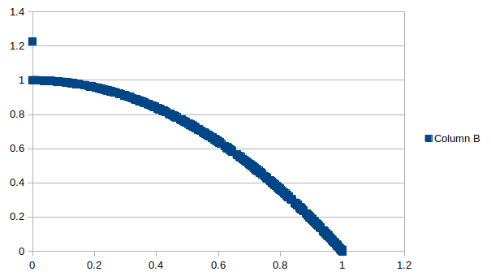

Thuật toán NSGA-II, triển khai bằng Java

- ```make```: Build chương trình
- ```make run```: Chạy chương trình

Kết quả được trình bày ra 2 file ```VAR.CSV``` là quần thể tìm được và ```FUN.CSV``` là giá trị các hàm mục tiêu của mỗi cá thể trong quần thể này.